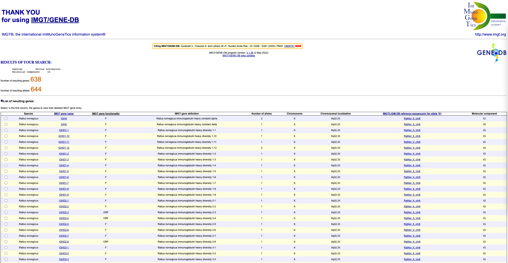
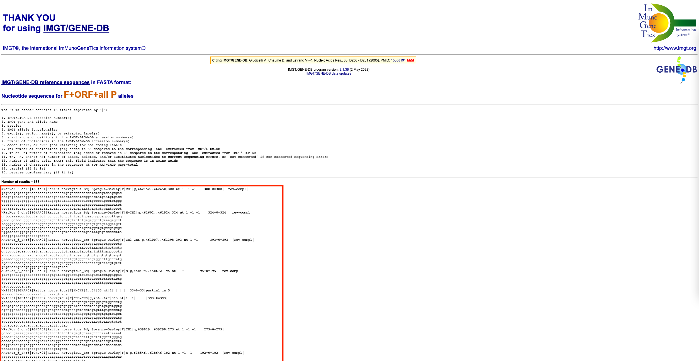
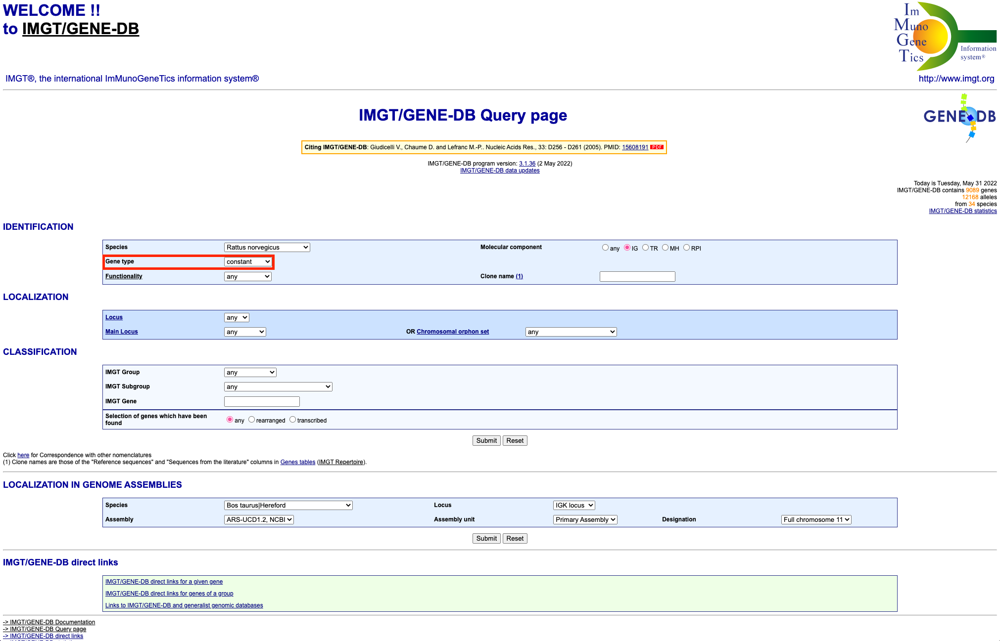
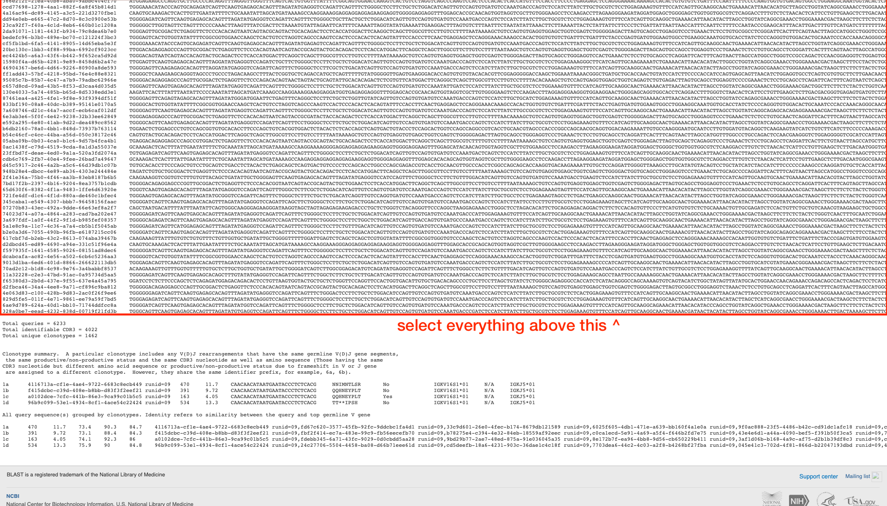

```{r setup, include=FALSE}
knitr::opts_chunk$set(echo = TRUE, root.dir = "/stornext/Home/data/allstaff/z/zeglinski.k/tutorial/")
library(readr)
library(dplyr)
library(tidyr)
library(stringr)
```

## Introduction {#introduction}

Welcome to the NAb-seq bioinformatics tutorial! This document will explain in detail how to generate
high-accuracy antibody consensus sequences from whole-transcriptome nanopore sequencing data, as
explained in the [NAb-seq paper](https://www.biorxiv.org/content/10.1101/2022.03.25.485728v1). An
end-to-end script that covers all of the steps is available from the [NAb-seq github
repository](https://github.com/kzeglinski/nab-seq), but going step-by-step is helpful for better
understanding the process and troubleshooting.\
\
The following figure summarises the steps of the NAb-seq workflow:


(since this is a bioinformatics tutorial, we will start from step 7, the sequencing QC)\
\

### Software required {#software-required}

The NAb-seq bioinformatics tutorial uses the following software:

-   [NanoComp](https://github.com/wdecoster/nanocomp) (optional, for QC purposes only)

-   [minimap2](https://github.com/lh3/minimap2) (for identification of antibody reads, and
    annotation of constant regions)

-   [cutadapt](https://github.com/marcelm/cutadapt) (for trimming of adapters & polyA tails)

-   [SeqKit](https://github.com/shenwei356/seqkit/) (for manipulation of sequence files)

-   [IgBLAST](https://www.ncbi.nlm.nih.gov/igblast/) (for annotation of variable regions)

-   [Racon](https://github.com/isovic/racon) (for consensus calling/error correction)

-   [Medaka](https://github.com/nanoporetech/medaka) (for consensus calling/error correction)

-   [R/RStudio](https://www.rstudio.com/) (for processing the output of various tools & analysing
    the results)

    -   [tidyverse](https://www.tidyverse.org/) packages will need to be installed\

As each tool is required during the analysis process, installation instructions are provided.
Alternatively, detailed instructions for installing and using each of the tools can be found at the
links above.\
\

### Input files {#input-files}

Before beginning, it is important to prepare the necessary input files. These are:

-   **Basecalled and demultiplexed 'pass' [fastq](https://en.wikipedia.org/wiki/FASTQ_format)
    files**. These files come from running nanopore's guppy basecalling tool, and should have names
    like barcode1_pass.fq.gz

    -   *Basecalling* means converting reads from raw signal into nucleotide sequences

    -   *Demultiplexing* means bioinformatically separating reads based on the barcodes added during
        library preparation

    -   *Pass reads* are reads that have an average quality above a certain cutoff (for nanopore
        super-high accuracy reads, this is a Q score of 10, or about 90% accuracy)

-   **Constant gene reference fasta file.** This should be a
    [fasta](https://en.wikipedia.org/wiki/FASTA_format) format file containing the sequences of all
    constant genes for your organism of interest. In the [NAb-seq github
    repository](https://github.com/kzeglinski/nab-seq), files for rat and mouse are provided. To
    ensure you have the most up-to-date information, or to make files for another organism, these
    reference sequences can be retrieved from the [IMGT
    website](https://www.imgt.org/vquest/refseqh.html#VQUEST). See [the
    appendix](#preparing-the-reference-files-from-imgt) for detailed instructions on how to prepare
    the reference files.

-   **Variable AND constant gene reference fasta file.** This file should be the same as above,
    except that it should include the V(D)J variable region genes as well as the constant ones.

-   **Sequencing summary .txt file.** This is a file generated during sequencing, and it contains
    information about the reads (e.g. length, quality, number). This file is optional: it is
    required only for the quality control (QC) process.\

In this tutorial, we will use as an example the reads from library A (representing the 7D10 antibody
sequence). More information about this sample and how it was generated can be found in the [NAb-seq
paper](https://www.biorxiv.org/content/10.1101/2022.03.25.485728v1). This data can be downloaded
from the [NAb-seq github repository](https://github.com/kzeglinski/nab-seq), in the `tutorial`
folder.\
\

## Quality control (QC) {#quality-control}

Quality control (QC) is an important first step in bioinformatic workflows. QC tools can give us an
idea of how well the sequencing run worked, in terms of the number of reads, what their quality
(accuracy) is and how long they are. There are a number of tools for QC of nanopore sequencing data,
but here we will use NanoComp.\
\

### QC with NanoComp {#qc-with-nanocomp}

NanoComp is written in python, and can be installed via pip using the command:
`pip install NanoComp`.

Once installed, the QC can be run as follows from within the `tutorial` folder:

```{bash run-nanocomp, eval=FALSE}
# make a folder to store the QC results
mkdir qc

# run NanoComp
NanoComp --threads 4 --outdir qc --prefix "hybridomas" --barcoded --summary input_data/sequencing_summary_AGG119_0904ab6e.txt.gz
```

Where:

-   `--threads 4` is the number of threads

-   `--outdir qc` tells NanoComp to put its output in the `qc` folder

-   `--prefix "hybridomas"` is the name we want to give this QC report

-   `--barcoded` tells NanoComp that our sequencing run is barcoded, so it will compare the various
    QC metrics across barcodes

-   `--summary` tells NanoComp the location of our sequencing summary file\
    \

This command will produce a range of output files. These include:

-   `hybridomasNanoComp-report.html` which is report that will open in any web browser, containing
    all of the QC plots

-   `hybridomasNanoComp-data.tsv.gz` which is a file that contains the raw QC data used to make the
    plots. This can be useful if you want to do further analysis or make figures for a publication

-   A range of .png files of each of the individual plots\

When looking at the results, the most important metric is the number of reads per barcode. **A
minimum of at least 40,000 reads per barcode is recommended**. Below this number, the number of
antibody transcripts may be insufficient to generate highly-accurate consensus sequences. If you are
trying to detect the presence of additional productive heavy/light chains (which may have a low
abundance [@bradbury2018]), then the more reads the better.\
\

## Identification of antibody reads {#identification-of-antibody-reads}

Once we have verified that the sequencing run went ok, the next step is to identify antibody reads.
We will do this by aligning all of our reads (which represent the whole transcriptome) to the IMGT
antibody reference sequences described in the [input files section](#input-files). The alignment
tool ([minimap2](https://github.com/lh3/minimap2)) will output a file describing all of the
alignments it found between our reads and the antibody reference sequences. We will process this
file in R to get a list of all candidate antibody reads, and then extract these from the main file
using [SeqKit](https://github.com/shenwei356/seqkit/).\
\

### Aligning reads to the antibody reference sequences {#aligning-all-reads-to-references}

If you don't have it already, you will first need to install minimap2. This is easiest through conda
(more information about setting up conda can be found
[here](https://docs.conda.io/projects/conda/en/latest/user-guide/getting-started.html)). You can
simply run the command `conda install -c bioconda minimap2`. Alternatively, it is available to
download from [github](https://github.com/lh3/minimap2/releases).\

Running minimap2 is straightforward:

```{bash identify-ab-reads-with-mm2, eval=FALSE}
# make a folder to store the results of this step
mkdir identifying_ab_reads

# run minimap2
minimap2 -x map-ont -n 4 \
reference_sequences/imgt_rattus_norvegicus_refs.fasta \
inputdata/library_A_pass.fq.gz > \
identifying_ab_reads/library_A_reference_alignment.paf
```

Where:

-   `-x map-ont` tells minimap2 to use settings designed for aligning error-prone long reads

-   `-n 4` is the number of threads

-   `reference_sequences/imgt_rattus_norvegicus_refs.fasta` is the location of the IMGT antibody
    reference sequence file described in the [input files section](#input-files).

-   `inputdata/library_A_pass.fq.gz` is the location of our basecalled, demultiplexed pass reads
    file

-   `identifying_ab_reads/library_A_reference_alignment.paf` is the output file, where minimap2 will
    give us information about the alignments\

We will now read this file into R to get a list of all the antibody-containing reads.

```{r parse-mm2-paf-for-ab-identification, warning=FALSE, message=FALSE}
# read the file into R
# col_names = FALSE lets it know that the first row isn't column names, rather it is data
library_A_paf <- read_tsv(
  "identifying_ab_reads/library_A_reference_alignment.paf", 
  col_names = FALSE)

# grab the first column, X1 (this is the one with the names of the antibody-containing reads)
# we use unique() here to account for reads aligning to multiple reference sequences
library_A_ab_read_names <- unique(library_A_paf$X1)

# write out these read names into a file, which we can use to subset our reads later
# we use \n (new line) to separate the names, so each name will be on its own line
write_lines(library_A_ab_read_names, 
            "identifying_ab_reads/library_A_ab_read_names.txt",
            sep = "\n")
```

\
Also, at this stage, you might want to check how many antibody containing reads you have, broken
down by whether they are heavy or light chain. This can be done in R as follows:

```{r count-num-of-ab-reads}
# to count heavy chain reads
length(unique(library_A_paf[grepl("IGH", library_A_paf$X6) ,]$X1))

# to count a specific heavy chain isotype, like IGHG
# can replace IGHG with IGHM or IGHA or IGHD etc
length(unique(library_A_paf[grepl("IGHG", library_A_paf$X6) ,]$X1))

# to count kappa light chains
length(unique(library_A_paf[grepl("IGK", library_A_paf$X6) ,]$X1))

# to count lambda light chains
length(unique(library_A_paf[grepl("IGL", library_A_paf$X6) ,]$X1))
```

At a minimum, **it would be good to have at least 25 reads for each of the heavy and light
chains**.\
\

### Extracting antibody reads {#extracting-antibody-reads}

Once we have a list of the names of the antibody-containing reads, we need to extract these from the
.fastq file that contains all our reads (the whole transcriptome). This will give us a second .fastq
file that just contains antibody sequences that will be used in the next steps.

To do this, we will use [SeqKit](https://github.com/shenwei356/seqkit/), a program designed for
manipulating .fasta and .fastq files. It is best downloaded through conda using the command
`conda install -c bioconda seqkit`. Other installation methods are available on the [SeqKit github
page](https://github.com/shenwei356/seqkit/).\
\

Once installed, we can extract the antibody containing reads as follows:

```{bash extract-ab-reads-with-seqkit, eval=FALSE}
seqkit grep --by-name --use-regexp \
-f identifying_ab_reads/library_A_ab_read_names.txt \
inputdata/library_A_pass.fq.gz \
-o identifying_ab_reads/library_A_ab_reads.fastq

```

Where:

-   `grep` is the tool within SeqKit that searches for sequences

-   `--by-name` tells SeqKit to match reads by their full name

-   `--use-regexp` tells SeqKit to use patterns that are [regular
    expressions](https://en.wikipedia.org/wiki/Regular_expression)

-   `-f identifying_ab_reads/library_A_ab_read_names.txt` tells SeqKit where it can find the read
    names

-   `-o identifying_ab_reads/library_A_ab_reads.fastq` is the output file (a .fastq file of just
    antibody reads)\
    \

## Read trimming {#read-trimming}

Now that we have our antibody reads, we need to trim off polyA tails. This is important because they
can interfere with the consensus calling process. Note that we do not need to trim off any adapters
for this data because when sequencing hybridomas using the nanopore PCR-cDNA kit as explained in the
[NAb-seq paper](https://www.biorxiv.org/content/10.1101/2022.03.25.485728v1), adapters and barcodes
are trimmed off by guppy after basecalling.

To trim our reads, we will use [cutadapt](https://github.com/marcelm/cutadapt). It can be installed
through conda using the following command: `conda install -c bioconda cutadapt`\
\

Once installed, cutadapt can be run as follows:

```{bash trim-reads-with-cutadapt, eval=FALSE}
cutadapt -a "A{100}" -g "T{100}" -n 2 \
-o identifying_ab_reads/library_A_trimmed.fastq \
identifying_ab_reads/library_A_ab_reads.fastq

```

Where:

-   `-a "A{100}"` tells cutadapt to trim a sequence of up to 100 repeated A nucleotides from the 3'
    end of the reads

-   `-g "T{100}"` tells cutadapt to trim a sequence of up to 100 repeated T nucleotides from the 5'
    end of the reads

-   `-n 2` tells cutadapt to run twice, once to detect the 3' polyA tail and once to detect the 5'
    polyT

-   `-o library_A_trimmed.fastq` is the output file containing our trimmed reads\
    \

After trimming it is also a good idea to make a .fasta version of this file (.fasta files contain
the sequence only, while .fastq files also contain base quality information). This is important
because IgBLAST (the tool we will use in the next step to identify variable region genes) needs a
.fasta format input file. It can be done using SeqKit:

```{bash seqkit-fq2fa, eval=FALSE}
seqkit fq2fa identifying_ab_reads/library_A_trimmed.fastq \
-o identifying_ab_reads/library_A_trimmed.fasta

```

\

## Grouping by germline genes {#grouping-by-germline-genes}

Now that the reads have been trimmed, we can begin the process of error correction. To ensure that
the corrections we make are accurate, we must group the antibody reads by their germline V(D)J
genes. This is because we know that not all of the heavy/light chain transcripts in a cell will be
the same: there may be leaky transcription from the second allele, hybridomas may express multiple
productive heavy/light chains [@bradbury2018] and there could be PCR chimeras between the different
transcripts. Our error correction approach relies on taking the consensus of multiple copies of the
**same** transcript, which means we first need to **group** those transcripts that are the same.
Transcripts are grouped based on their variable and constant germline genes which we will identify
using IgBLAST and minimap2 respectively.\
\

### Annotation of variable regions using IgBLAST {#annotation-using-igblast}

We can identify variable region genes (V, D and J) using
[IgBLAST](https://www.ncbi.nlm.nih.gov/igblast/). Other tools you could use include
[MiGMAP](https://github.com/mikessh/migmap) or
[IMGT/HighV-QUEST](https://www.imgt.org/IMGTindex/IMGTHighV-QUEST.php) but here we will focus on
[IgBLAST](https://www.ncbi.nlm.nih.gov/igblast/) as it is freely available and can be used through a
[webserver](https://www.ncbi.nlm.nih.gov/igblast/) or the [command
line](https://ncbi.github.io/igblast/).

Installing the command line version of IgBLAST is relatively complicated. The official instructions
are available [here](https://ncbi.github.io/igblast/cook/How-to-set-up.html), and there is another
good guide [here](https://github.com/xinyu-dev/igblast). If you would prefer to use the web version,
there are step-by-step instructions available in [the appendix](#using-igblast-webserver).\
\

The command-line tool can be used as follows:

```{bash pre-consensus-igblast, eval=FALSE}
# first, make the directory that we will use to store this step's results
mkdir grouping_by_germline_genes
mkdir consensus_calling

igblast_database_path="put your path here"
igblast_auxiliary_data_path="put your path here"
igblastn -germline_db_V ${igblast_database_path}/rat_V \
-germline_db_J ${igblast_database_path}/rat_J \
-germline_db_D ${igblast_database_path}/rat_D \
-organism rat \
-query identifying_ab_reads/library_A_trimmed.fasta \
-auxiliary_data $igblast_auxiliary_data_path -show_translation \
-num_alignments_V 1 -num_alignments_D 1 -num_alignments_J 1 \
-outfmt 19 > \
grouping_by_germline_genes/library_A_igblast_pre_consensus.tsv
```

Where:

-   `igblast_database_path` is the path to your IgBLAST database

-   `igblast_auxiliary_data_path` is the path to your auxiliary_data file

-   `-query identifying_ab_reads/library_A_trimmed.fasta` tells IgBLAST where to find your trimmed
    .fasta file of antibody reads

-   `-num_alignments_V` (and D and J) are the number of V/D/J genes that IgBLAST will output for
    each clone

-   `-show_translation` tells IgBLAST to show the amino acid sequence

-   `-outfmt 19` tells IgBLAST to output an [AIRR formatted
    table](https://docs.airr-community.org/en/stable/datarep/rearrangements.html)\
    \

### Annotation of constant regions using minimap2 {#annotation-using-minimap2}

As of 13/12/21 IgBLAST can now identify constant regions, but since NAb-seq was developed prior to
this we will use [minimap2](https://github.com/lh3/minimap2) instead. The process is very similar to
how we [identified the antibody reads](#identification-of-antibody-reads), except this time we will
use the reference file that only contains constant genes (as described in the
[introduction](#input-files)).\
\

```{bash annotate-constant-with-mm2, eval=FALSE}
# if you haven't already, make a directory to store the results of the grouping step
mkdir grouping_by_germline_genes

# run minimap2
minimap2 -x map-ont -n 4 \
reference_sequences/imgt_rattus_norvegicus_constant_regions.fasta \
identifying_ab_reads/library_A_trimmed.fastq > \
grouping_by_germline_genes/library_A_constant_alignment.paf
```

Where:

-   `-x map-ont` tells minimap2 to use settings designed for aligning error-prone long reads

-   `-n 4` is the number of threads

-   `reference_sequences/imgt_rattus_norvegicus_constant_regions.fasta` is the location of the
    **constant region only** IMGT antibody reference sequence file described in the [input files
    section](#input-files).

-   `identifying_ab_reads/library_A_trimmed.fastq` is the location of our trimmed reads from the
    previous step

-   `grouping_by_germline_genes/library_A_constant_alignment.paf` is the output file, where minimap2
    will give us information about the constant regions of our reads

We will now combine the variable and constant region calls in R.\
\

### Grouping reads by germline genes in R {#grouping-reads-by-germline-genes}

#### Combining the variable and constant calls {#combining-constant-and-variable-for-grouping}

Before we can group the reads, we need to combine our variable and constant calls into one big
table. First, we need to read the files in:

```{r read-in-for-combining-during-grouping, warning=FALSE, message=FALSE}
# read in variable calls
library_A_variable_calls <- read_tsv(
  "grouping_by_germline_genes/library_A_igblast_pre_consensus.tsv")

# read in constant calls
library_A_constant_calls <- read_tsv(
  "grouping_by_germline_genes/library_A_constant_alignment.paf", 
  col_names = FALSE)
```

\
Next, we need to clean up the constant region calls data a little:

```{r clean-up-constant-calls-during grouping}
# for the constant calls, we only need three columns: the read name, the read length and the constant gene (C) call
# select these columns:
library_A_constant_calls <- library_A_constant_calls[, c(1, 2, 6)]

# give them informative names
colnames(library_A_constant_calls) <- c("read_name", "read_length", "c_call")

# remove any duplicate rows (antibodies with 2+ C gene calls)
library_A_constant_calls <- distinct(library_A_constant_calls, read_name, .keep_all = TRUE)

# tidy up the constant gene names (remove the extra information so it's just like IGKC*02 etc)
library_A_constant_calls$c_call <- str_replace(library_A_constant_calls$c_call, ".*?\\|", "")
library_A_constant_calls$c_call <- str_replace(library_A_constant_calls$c_call, "\\|.*", "")
```

\
Finally, we can combine the two tables:

```{r combine-tables-for-grouping}
# tidy up the read names (remove extra information so they can be easily matched)
library_A_constant_calls$read_name <- str_replace(library_A_constant_calls$read_name, "_.*", "")
library_A_variable_calls$sequence_id <- str_replace(library_A_variable_calls$sequence_id, "_.*", "")

# combine the two into one big table
library_A_calls <- left_join(library_A_variable_calls, library_A_constant_calls, 
                             by = c("sequence_id" = "read_name"))
```

\

#### Grouping the reads {#grouping-reads}

Now that we have a single table with all of the information about our antibody reads, we can group
those that are the same.

```{r grouping-pre-consensus}
# add n column to count up how many reads fall into each 
library_A_calls$n <- rep(1, nrow(library_A_calls))

# group the reads
library_A_calls %>%
  group_by(v_call, d_call, j_call, c_call) %>%
  summarise(count = sum(n), .groups = "keep", 
            reads = paste(sequence_id, collapse = "\n")) -> grouped_library_A_calls

# write out a copy of this table 
write_tsv(grouped_library_A_calls, 
          "grouping_by_germline_genes/grouped_library_A_calls.tsv")

```

\

At this stage, you might like to take a closer look at the grouped gene calls. In the next step, we
will prepare the necessary files for calling a consensus on the top *n* most abundant groups. You
can choose a value of *n* that suits you, although it is worth keeping in mind that:

1.  A consensus can't be called for groups with less than 3 reads

2.  For groups with 3-5 reads, although a consensus can be called it is unlikely to be 100% accurate

3.  One of the tools used for consensus calling, [Medaka](https://github.com/nanoporetech/medaka),
    takes a fair bit of time to initialise for each group you want to call a consensus on. If you
    want to call large numbers (\>300) of consensus sequences you may want to consider parallelising
    this step

In general, we recommend calling a consensus for the top 25 or 50 groups. In this tutorial, we will
use the top 25.\
\

#### Preparing for consensus calling {#preparing-for-consensus}

We will now prepare the files for consensus calling. We need to choose a 'starting copy' that will
form the basis for the error correction and make a list of all of the other reads that will be used
for the correction.

```{r preparing-consensus-files}
# separate out the heavy and light chains
grouped_library_A_calls_H <- filter(grouped_library_A_calls, str_detect(v_call, "H"))
grouped_library_A_calls_L <- filter(grouped_library_A_calls,
                                    str_detect(v_call, "H", negate = TRUE))

# sort them in descending order by read count
grouped_library_A_calls_H <- arrange(grouped_library_A_calls_H, desc(count))
grouped_library_A_calls_L <- arrange(grouped_library_A_calls_L, desc(count))

# select the top n clones (here, n = 25)
# just edit these lines to change the number of groups a consensus will be called for
grouped_library_A_calls_H <- grouped_library_A_calls_H[1:25,]
grouped_library_A_calls_L <- grouped_library_A_calls_L[1:25,]

# give each clone's H and L chain a unique name in the form of H1, H2, L1, L2 etc where 1 is the most abundant, 2 is the second most abundant etc
grouped_library_A_calls_H$group_id <- paste0("H", seq_len(nrow(grouped_library_A_calls_H)))
grouped_library_A_calls_L$group_id <- paste0("L", seq_len(nrow(grouped_library_A_calls_L)))

# write out the read names for each clone into a .txt file
for (i in seq_along(
  grouped_library_A_calls_H$group_id)) {
  this_group_id <- grouped_library_A_calls_H$group_id[i]
  write_lines(
    x = grouped_library_A_calls_H$reads[i],
    file = paste0("consensus_calling/library_A_",
                  this_group_id, ".txt"))
}

for (i in seq_along(
  grouped_library_A_calls_L$group_id)) {
  this_group_id <- grouped_library_A_calls_L$group_id[i]
  write_lines(
    x = grouped_library_A_calls_L$reads[i],
    file = paste0("consensus_calling/library_A_",
                  this_group_id, ".txt"))
}

# choose the starting copy 
# make a long format data where each read is a row (but still keep track of which group each read belongs to) 
grouped_library_A_calls_long <- bind_rows(
  separate_rows(grouped_library_A_calls_L, reads, sep = "\n"),
  separate_rows(grouped_library_A_calls_H, reads, sep = "\n"))

# combine this with the read length from the library_A_calls table so that we can choose the longest read in each group
grouped_library_A_calls_long <- left_join(
  library_A_calls[, c("sequence_id", "read_length")], 
  grouped_library_A_calls_long[, c("reads", "group_id")], 
  by = c("sequence_id" = "reads"))

# remove the reads that do not belong to a group
grouped_library_A_calls_long <- 
  grouped_library_A_calls_long[!is.na(grouped_library_A_calls_long$group_id) ,]

# select the longest read for each group (more likely to have a full-length constant region)
grouped_library_A_calls_long %>% 
  group_by(group_id) %>% 
  slice(which.max(read_length)) -> library_A_grouped_longest_reads

# write out these longest reads as the starting copies
for (i in seq_along(library_A_grouped_longest_reads$sequence_id)) {
  this_group_id <- library_A_grouped_longest_reads$group_id[i]
  write_lines(x = library_A_grouped_longest_reads$sequence_id[i],
              file = paste0("consensus_calling/library_A_", this_group_id, "_starting_point_name.txt"))
}
```

\

## Consensus calling {#consensus-calling}

Consensus calling is a way to correct errors in sequencing data. By stacking up copies of the same
sequence and taking their consensus, it is possible to remove random errors that likely occur in
only one of the copies. NAb-seq employs a two-step consensus calling approach, using
[Racon](https://github.com/isovic/racon) and [Medaka](https://github.com/nanoporetech/medaka) on
each group of reads from the previous step.\

The following code will call the consensus for the 25 most abundant heavy and light chains. It
should be executed as a shell script.

<details>

<summary>

Click here to show/hide consensus calling code

</summary>

```{bash, eval=FALSE}
rebasecalled_reads_file=identifying_ab_reads/library_A_trimmed.fastq
current_dir=consensus_calling/

# heavy chain
for i in {1..25}
do
  # set up the file names
  # the clone name is the name of this group of V(D)JC genes
	clone_name=library_A_H${i}
	echo $clone_name
	# the read name file contains all of the reads in the group
	read_name_file=${current_dir}${clone_name}.txt
	# the starting point name file contains the name of the read that will be used for polishing
	starting_point_name_file=${current_dir}${clone_name}_starting_point_name.txt
	# these are the reads named in the read_name_file
	clone_reads_file=${current_dir}${clone_name}_reads.fastq
	# this is the same file as above, but with the reads renamed (long read names or odd characters can cause problems with the tools we will use later)
	clone_reads_file_renamed=${current_dir}${clone_name}_reads_renamed.fastq
	# this is the same file as above, but with duplicates renamed (duplicates cause issues with the consensus calling tools)
	clone_reads_file_renamed_dup_fixed=${current_dir}${clone_name}_reads_renamed_dup_fixed.fastq
	# this removes any sequences with length 0 (again, causes issues with the tools)
	clone_reads_file_renamed_dup_fixed_len_fixed=${current_dir}${clone_name}_reads_renamed_dup_fixed_len_fixed.fastq
	# this is the read that will be the starting point for polishing
	polishing_starting_point=${current_dir}${clone_name}_starting_point.fastq
	# the starting point, renamed
	polishing_starting_point_renamed=${current_dir}${clone_name}_starting_point_renamed.fastq
	# the alignment of the reads in the group to the starting point
	all_to_start_overlaps=${current_dir}${clone_name}_overlaps.sam
	# the output file from racon
	racon_consensus=${current_dir}${clone_name}_racon_consensus.fasta
	# the output folder from medaka
	medaka_consensus_folder=${current_dir}/${clone_name}/

	
	# confirm we have a starting point for polishing (if not, then skip this group)
	if [ -f "$starting_point_name_file" ]; then
    	echo "found starting point"
	else 
    	continue
	fi

	# extract reads from fastq
	# clean up file as descibed above 
	seqkit grep -n -r -f $read_name_file $rebasecalled_reads_file -o $clone_reads_file
	seqkit replace -p "\_.*" -r "" $clone_reads_file > $clone_reads_file_renamed
	seqkit rename $clone_reads_file_renamed > $clone_reads_file_renamed_dup_fixed
	seqkit seq -m 1 $clone_reads_file_renamed_dup_fixed > $clone_reads_file_renamed_dup_fixed_len_fixed

	# extract starting copy
	seqkit grep -n -r -f $starting_point_name_file $rebasecalled_reads_file -o $polishing_starting_point
	seqkit replace -p ".*" -r $clone_name $polishing_starting_point > $polishing_starting_point_renamed

	# run racon
	# need to align first
	minimap2 $polishing_starting_point_renamed $clone_reads_file_renamed_dup_fixed_len_fixed --secondary=no -ax map-ont -o $all_to_start_overlaps
	racon -w 5000 -t 4 -u -g -8 -x -6 -m 8 --no-trimming $clone_reads_file_renamed_dup_fixed_len_fixed $all_to_start_overlaps $polishing_starting_point_renamed > $racon_consensus 

	# run medaka
	mkdir $medaka_consensus_folder
	medaka_consensus -i $clone_reads_file_renamed_dup_fixed_len_fixed -d $racon_consensus -o $medaka_consensus_folder -t 4 -m r941_min_sup_g507
	
	# clean up the output
	mv ${medaka_consensus_folder}/consensus.fasta ${current_dir}/${clone_name}_medaka_consensus.fasta
	rm -rf $medaka_consensus_folder
done

# light chain
for i in {1..25}
do
	clone_name=${barcode}_L${i}
	echo $clone_name
	read_name_file=${current_dir}${clone_name}.txt
	starting_point_name_file=${current_dir}${clone_name}_starting_point_name.txt
	clone_reads_file=${current_dir}${clone_name}_reads.fastq
	clone_reads_file_renamed=${current_dir}${clone_name}_reads_renamed.fastq
	clone_reads_file_renamed_dup_fixed=${current_dir}${clone_name}_reads_renamed_dup_fixed.fastq
	clone_reads_file_renamed_dup_fixed_len_fixed=${current_dir}${clone_name}_reads_renamed_dup_fixed_len_fixed.fastq
	polishing_starting_point=${current_dir}${clone_name}_starting_point.fastq
	polishing_starting_point_renamed=${current_dir}${clone_name}_starting_point_renamed.fastq
	all_to_start_overlaps=${current_dir}${clone_name}_overlaps.sam
	racon_consensus=${current_dir}${clone_name}_racon_consensus.fasta
	medaka_consensus_folder=${current_dir}/${clone_name}/

	
	# test if we have a full-length starting point. for now we are only proceeding with full-length starting copies (something to change in future???)
	if [ -f "$starting_point_name_file" ]; then
    	echo "found starting point"
	else 
    	continue
	fi

	# extract reads from fastq
	seqkit grep -n -r -f $read_name_file $rebasecalled_reads_file -o $clone_reads_file
	seqkit replace -p "\_.*" -r "" $clone_reads_file > $clone_reads_file_renamed
	seqkit rename $clone_reads_file_renamed > $clone_reads_file_renamed_dup_fixed
	seqkit seq -m 1 $clone_reads_file_renamed_dup_fixed > $clone_reads_file_renamed_dup_fixed_len_fixed

	# extract starting copy
	seqkit grep -n -r -f $starting_point_name_file $rebasecalled_reads_file -o $polishing_starting_point
	seqkit replace -p ".*" -r $clone_name $polishing_starting_point > $polishing_starting_point_renamed
	
	# run racon
	minimap2 $polishing_starting_point_renamed $clone_reads_file_renamed_dup_fixed_len_fixed --secondary=no -ax map-ont -o $all_to_start_overlaps
	racon -w 5000 -t 4 -u -g -8 -x -6 -m 8 --no-trimming $clone_reads_file_renamed_dup_fixed_len_fixed $all_to_start_overlaps $polishing_starting_point_renamed > $racon_consensus 

	# run medaka
	mkdir $medaka_consensus_folder
	medaka_consensus -i $clone_reads_file_renamed_dup_fixed_len_fixed -d $racon_consensus -o $medaka_consensus_folder -t 4 -m r941_min_sup_g507
	mv ${medaka_consensus_folder}/consensus.fasta ${current_dir}/${clone_name}_medaka_consensus.fasta
	rm -rf $medaka_consensus_folder
done
```

</details>

\
After the script is finished running, check that the consensus sequences were generated ok and then
combine them into one file:

```{bash combining-consensus-sequences, eval=FALSE}
cat consensus_calling/*_medaka_consensus.fasta > consensus_calling/library_A_consensus_sequences.fasta

```

\

## Final annotation and analysis {#final-annotation-and-analysis}

Once the highly accurate consensus sequences have been generated, they need to be re-annotated using
IgBLAST and minimap2, to confirm the V(D)JC genes (in particular, the D gene can sometimes change
after the consensus is made, as sequencing errors can cause it to be mis-called). Finally, the
resulting sequences can be analysed.\
\

### Annotation of variable regions using IgBLAST {#final-annotation-using-igblast}

As before, instructions will be provided for the command line version of IgBLAST. If you would
prefer to use the web server, there are step-by-step instructions available in [the
appendix](#using-igblast-webserver).\
\

The command-line tool can be used as follows:

```{bash post-consensus-igblast, eval=FALSE}
# first, make the directory that we will use to store this step's results
mkdir final_analysis

igblast_database_path="put your path here"
igblast_auxiliary_data_path="put your path here"
igblastn -germline_db_V ${igblast_database_path}/rat_V \
-germline_db_J ${igblast_database_path}/rat_J \
-germline_db_D ${igblast_database_path}/rat_D \
-organism rat \
-query consensus_calling/library_A_consensus_sequences.fasta \
-auxiliary_data $igblast_auxiliary_data_path -show_translation \
-num_alignments_V 1 -num_alignments_D 1 -num_alignments_J 1 \
-outfmt 19 > \
final_analysis/library_A_igblast_post_consensus.tsv
```

Where:

-   `igblast_database_path` is the path to your IgBLAST database

-   `igblast_auxiliary_data_path` is the path to your auxiliary_data file

-   `-query consensus_calling/library_A_consensus_sequences.fasta` tells IgBLAST where to find your
    .fasta file of antibody consensus sequences

-   `-num_alignments_V` (and D and J) are the number of V/D/J genes that IgBLAST will output for
    each clone

-   `-show_translation` tells IgBLAST to show the amino acid sequence

-   `-outfmt 19` tells IgBLAST to output an [AIRR formatted
    table](https://docs.airr-community.org/en/stable/datarep/rearrangements.html)\
    \

### Annotation of constant regions using minimap2 {#final-annotation-using-minimap2}

Again, this step is more or less the same as in the [grouping by germline
genes](#annotation-using-minimap2) section.

```{bash annotate-constant-with-mm2-final, eval=FALSE}
# if you haven't already, make a directory to store the results of the grouping step
mkdir final_analysis

# run minimap2
minimap2 -x map-ont -n 4 \
reference_sequences/imgt_rattus_norvegicus_constant_regions.fasta \
consensus_calling/library_A_consensus_sequences.fasta > \
final_analysis/library_A_final_constant_alignment.paf
```

Where:

-   `-x map-ont` tells minimap2 to use settings designed for aligning error-prone long reads

-   `-n 4` is the number of threads

-   `reference_sequences/imgt_rattus_norvegicus_constant_regions.fasta` is the location of the
    **constant region only** IMGT antibody reference sequence file described in the [input files
    section](#input-files).

-   `consensus_calling/library_A_consensus_sequences.fasta` is the location of our consensus
    sequences from the previous step

-   `final_analysis/library_A_final_constant_alignment.paf` is the output file, where minimap2 will
    give us information about the constant regions of our reads\
    \

### Further analysis in R {#further-analysis}

Now that we have annotated the consensus sequences, we can finally bring the data together in R.

```{r final-combine-data, warning=FALSE, message=FALSE}
# read in the variable region calls 
library_A_consensus_variable_calls <- read_tsv("final_analysis/library_A_igblast_post_consensus.tsv")

# read in constant region calls
library_A_consensus_constant_calls <- read_tsv("final_analysis/library_A_final_constant_alignment.paf", col_names = FALSE)

# clean up the constant calls as before 
# keep only the name and the constant gene call
library_A_consensus_constant_calls <- library_A_consensus_constant_calls[, c(1, 6)]
# set informative names for the columns
colnames(library_A_consensus_constant_calls) <- c("read_name", "c_call")
# remove any duplicates
library_A_consensus_constant_calls <- 
  distinct(library_A_consensus_constant_calls, 
           read_name, .keep_all = TRUE)

# fix the constant gene names (remove extra text so it's just the allele name like IGKC*02 etc)
library_A_consensus_constant_calls$c_call <- str_replace(
  library_A_consensus_constant_calls$c_call, ".*?\\|", "")
library_A_consensus_constant_calls$c_call <- str_replace(
  library_A_consensus_constant_calls$c_call, "\\|.*", "")

# combine the constant and variable calls
library_A_consensus_calls <- left_join(
  library_A_consensus_variable_calls,
  library_A_consensus_constant_calls, 
  by = c("sequence_id" = "read_name"))

# tidy up the sequence IDs
library_A_consensus_calls$sequence_id <- str_replace(
  library_A_consensus_calls$sequence_id, "^.*_", "")

# make a smaller table with just the key columns
# since the full AIRR format is so massive
library_A_consensus_calls_key_info <- 
  library_A_consensus_calls[, c("sequence_id", "productive",
                                "v_call", "d_call", "j_call", 
                                "cdr3_aa", "v_identity", "c_call")]

# take a look at the key info 
head(library_A_consensus_calls_key_info)
```

\

Now that you have this information, it might be nice to do some further analysis! As an example,
let's take a look at the productive heavy and light chains, to see if this hybridoma might express
multiple functional antibody sequences as reported in the literature [@bradbury2018].\
\
First, we can add the counts for each group that we determined in the [preparing for consensus
calling](#preparing-for-consensus) step to our final data table, so that we have all the information
in one place. Then, we can filter the data to look for productive sequences only.

```{r adding-counts-to-post-consensus-data}
# add the count information
# for heavy chains
library_A_consensus_calls_key_info <- left_join(
  library_A_consensus_calls_key_info,
  grouped_library_A_calls_H[, c("group_id", "count")], 
  by = c("sequence_id" = "group_id"))

# for light chains
library_A_consensus_calls_key_info <- left_join(
  library_A_consensus_calls_key_info,
  grouped_library_A_calls_L[, c("group_id", "count")], 
  by = c("sequence_id" = "group_id"))
  
# combine the counts into one column and sort in descending order
library_A_consensus_calls_key_info %>% 
  mutate(count = coalesce(count.x, count.y)) %>%
  select (-c(count.x, count.y)) %>%
  arrange(desc(count)) -> library_A_consensus_calls_key_info

# filter for productive sequences only
library_A_consensus_calls_key_info[library_A_consensus_calls_key_info$productive == TRUE ,]
```

From this, we can note a couple of things:

1.  After consensus calling, many groups that were previously called as different become the same
    (for example, L1 and L7 or H1 and H4, H15, H19, H20 etc). This is because previously, sequencing
    errors caused their gene calls to be different. Once these errors are corrected, they are
    revealed to be the same sequence.

2.  Sometimes, IgBLAST is not able to identify D genes well (as for the heavy chain in this
    example). In this case, it is recommended to try
    [IMGT/V-QUEST](https://www.imgt.org/IMGT_vquest/analysis), which generally performs better at
    this task. Alternatively, changing some of IgBLAST's D gene matching parameters may help.

3.  This hybridoma likely expresses an additional functional light chain (L20 and L22, with the CDR3
    sequence QHIRELT).\
    \

## Summary {#summary}

Thank you for following the NAb-seq bioinformatics tutorial! Hopefully this has cleared up any
questions you have about the process. If not, feel free to [open an issue on
github](https://github.com/kzeglinski/nab-seq/issues) or send an email to zeglinski.k\@wehi.edu.au\
\

## Appendices {#appendices}

### Preparing the reference files from IMGT {#preparing-the-reference-files-from-imgt}

This section describes how to prepare the reference files described in the ['input
files'](#input-files) section. As an example, we will prepare the *Rattus norvegicus* reference
files used in this tutorial.

1.  Visit the [IMGT/GENE-DB website](https://www.imgt.org/genedb/)

2.  Select your species, and select the 'IG' option under 'Molecular component'. Then, click
    submit

    You should see a page that looks like this:

    

3.  To get the sequences in fasta format, scroll down to the bottom of the page and click on the
    'select all genes' tickbox. Then, choose 'F+ORF+all P nucleotide sequences' under the
    'IMGT/GENE-DB allele reference sequences in FASTA format' section. Finally, click
    submit.

    You should see a page that looks like this: 

4.  Copy the fasta format sequences (everything below the 'Number of results' line, as indicated by
    the red box above. Paste these sequences into a text editor (e.g. TextEdit on Mac or Notepad on
    Windows). Save this file with a .fasta extension (e.g.
    variable_and_constant_references_rattus_norvegicus.fasta)

5.  Done!

The constant region only reference file can be prepared in the same way, except in the second step
you should select 'constant' from the 'Gene type' dropdown box: \

### Using the IgBLAST webserver {#using-igblast-webserver}

This section describes how to use the [IgBLAST webserver](https://www.ncbi.nlm.nih.gov/igblast/).
Note that currently, only human, mouse, rat, rabbit and rhesus monkey are available through this
tool (for other organisms, you must use the command line IgBLAST or an alternative tool as described
in the [read grouping section](#annotation-using-igblast)).

1.  [Visit the IgBLAST webpage](https://www.ncbi.nlm.nih.gov/igblast/)

2.  Upload your trimmed .fasta file (see [read trimming section](#read-trimming)) and change the
    following settings:

After uploading the file, you need to select your organism from the drop down box, and then under
formatting options choose '1' for the number of V, D and J genes to display. Set the 'number of
clonotypes to show' to '1' (this won't affect results, just a summary table we don't care about) and
the 'alignment format' to 'AIRR rearrangement table'. 

Then, press 'search' and after a short wait, you should see a page that looks like this:


3.  Scroll to the bottom of the page, and select all rows of the first table, as shown in the
    following image: 

4.  Copy paste that first table into a text editor and save it as a .tsv file (for example,
    library_A\_igblast_pre_consensus.tsv). This file can then be used to continue with the [read
    grouping step](#grouping-reads-by-germline-genes).
